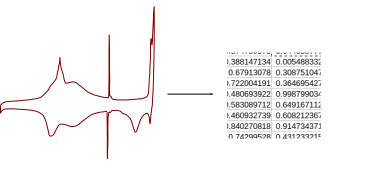

# SVGDigitizer — Create (x,y) Data Points from SVG files.



The purpose of this project is to digitize plots in scientific publications, recovering the measured data visualized in such a plot.


`svgdigitizer.py` can be used to generate xy data of any kind from svg files. It creates data from multiple paths in a single plot.  
 
```python
from svgdigitizer import SvgData
filename='Ni111_NaOH_Beden1985_Fig2c.svg'
svg = SvgData(filename)
svg.plot()
```

`csvcreator.py` should contain converters for specific data. At the moment to create CV data.   
It is based on `svgdigitizer.py`. It only requires the filename without extension, which is generated automatically for the required svg and yaml file. These should however have the same filename.

```python
from csvcreator import CreateCVdata
csv = CreateCVdata('Ni111_NaOH_Beden1985_Fig2c', create_csv=False)
csv.df.head()
csv.plot_CV()
```
